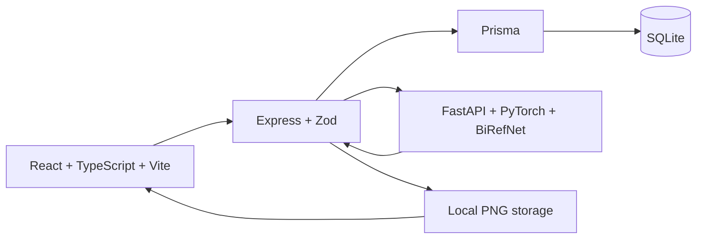

# Outfit Picker

A digital closet for the clothes you already own. Upload a top or bottom, remove its photo background locally, keep track of its details, and put together outfits you can save for later.


## What works

- Create, browse, edit, and delete clothing with name, category, type, color, brand, size, and notes.
- Upload JPEG, PNG, or WebP photos, rotate them, process them with BiRefNet, and review the transparent result before saving.
- Search name, brand, notes, size, color, category, and clothing type. Combine category, type, color, brand, and size filters; sort by name or date.
- Pick a top and bottom using thumbnails or previous/next arrows. See a stacked preview and save a named outfit.
- View and delete saved outfits with their actual clothing photos. Load a saved look into the builder to make another combination.
- Remove or replace a photo from the clothing form without starting over.
- Keep records in SQLite and processed PNGs on disk. No demo wardrobe is automatically inserted.
- Use keyboard-accessible cards and dialogs, responsive layouts, loading feedback, and recoverable error messages.

Shoes, accounts, recommendations, and cloud storage are outside this version.

## Architecture



The browser handles interaction and photo preparation. Express validates requests, manages records, and owns image storage. Python handles model inference only. Outfits reference real clothing rows through `OutfitItem`, with a top and bottom role.

Deleting clothing removes every saved outfit that uses it in the same database transaction. Changing the category of an item used by an outfit is rejected until those outfits are removed. Editing its name, photo, and other details still works.

## Run locally

Use Node.js 24 and Python 3.12. Commands below are PowerShell, run from the project root. Python dependencies and the first model download need several GB of disk space. A GPU is optional; CPU inference works but takes longer.

### Install and initialize

```powershell
npm --prefix frontend ci
npm --prefix backend ci
if (!(Test-Path backend/.env)) { Copy-Item backend/.env.example backend/.env }
npm --prefix backend run db:setup

py -3.12 -m venv image-service/.venv
image-service/.venv/Scripts/python.exe -m pip install -r image-service/requirements.txt
```

`db:setup` creates a missing database file, generates Prisma's client, and applies the schema. It does not clear existing records. The optional seed command also leaves existing data alone. Stop the API before regenerating Prisma on Windows so its database engine is not locked.

Virtual environments are tied to their original Python installation. If you copied the project and its Python executable no longer starts, create a fresh environment with a working Python 3.12 installation and reinstall the requirements.

### Start three terminals

Image service:

```powershell
cd image-service
.venv/Scripts/python.exe -m uvicorn app:app --host 127.0.0.1 --port 8001
```

Wait for `Application startup complete`. The first launch downloads the model from Hugging Face. Subsequent launches reuse the cache.

API:

```powershell
cd backend
npm run dev
```

Frontend:

```powershell
cd frontend
npm run dev
```

Open [localhost:5173](http://localhost:5173). The API runs on port 4000 and the image service on port 8001.

To run the compiled API, use `npm run build` followed by `npm start` in `backend`. For a built frontend, use `npm run build` then `npm run preview` in `frontend`; set `CLIENT_URL=http://localhost:4173` in the backend environment for that preview origin.

On macOS/Linux use `python3.12 -m venv image-service/.venv` and the `.venv/bin/python` executable.

## Image processing and its limits

The model is [ZhengPeng7/BiRefNet](https://huggingface.co/ZhengPeng7/BiRefNet), with its model/code revision pinned to `e2bf8e4460fc8fa32bba5ea4d94b3233d367b0e4`. It uses PyTorch and Transformers locally, with CUDA when available and CPU otherwise. No clothing photos are sent to a hosted inference API. The model's published license is MIT; see the [author's repository](https://github.com/ZhengPeng7/BiRefNet).

BiRefNet separates foreground from background. **It is not a clothing-specific parser.** A photo of a person wearing a shirt can keep the person, and nearby objects or a hanger may remain. For best results, photograph one piece laid flat against a contrasting background. Review the preview before saving. The screenshots show actual model results, including these limitations.

Uploads are limited to 10 MB and 25 megapixels. The browser applies camera orientation and resizes large photos to a maximum edge of 1600 pixels. Python validates the decoded format, runs one inference at a time, applies a soft transparency mask, and crops transparent margins. Express checks the returned PNG structure, bounds its size, and uses a UUID filename. It times out after 180 seconds by default.

Only processed photos are stored in `backend/uploads/`; originals are handled in memory. The database stores `/uploads/<uuid>.png`. Development and compiled builds use the same directory. Referenced photos are kept when a preview is discarded or another item sharing that photo is deleted. Closed forms clean up their unsaved previews; after an interrupted browser session, remove unreferenced images older than 24 hours with:

```powershell
npm --prefix backend run cleanup:uploads
```

Back up both `backend/prisma/dev.db` and `backend/uploads/` to keep the full wardrobe.

## Configuration

| Variable | Default | Purpose |
| --- | --- | --- |
| `DATABASE_URL` | `file:./dev.db` | SQLite file, relative to `backend/prisma` |
| `HOST` | `127.0.0.1` | API bind address |
| `PORT` | `4000` | API port |
| `CLIENT_URL` | `http://localhost:5173` | Allowed browser origin |
| `IMAGE_SERVICE_URL` | `http://127.0.0.1:8001` | Local inference endpoint |
| `IMAGE_PROCESSING_TIMEOUT_MS` | `180000` | Inference request timeout |
| `UPLOADS_DIRECTORY` | `backend/uploads` | Optional absolute image directory |
| `VITE_API_BASE_URL` | `http://localhost:4000/api` | Frontend API URL |
| `BIREFNET_MODEL_ID` | `ZhengPeng7/BiRefNet` | Python model repository or local directory |
| `BIREFNET_REVISION` | Pinned commit above | Model/code revision |

The Node API reads `backend/.env`. Set Python options in its shell environment; the Python service does not automatically load a `.env` file. `BIREFNET_SKIP_MODEL=1` is only for tests and skips eager startup loading. `HF_HUB_OFFLINE=1` can be used once the model is cached.

This is a local, single-user app. Authentication, per-user ownership, public upload rate limits, TLS, and hosted storage are future work before exposing it on the internet. CORS is not authentication.

## API

| Method | Route | Behavior |
| --- | --- | --- |
| GET | `/api/health` | API health |
| GET / POST | `/api/clothing` | List/filter or create clothing |
| GET / PATCH / DELETE | `/api/clothing/:id` | Read, edit, or remove a piece |
| GET / POST | `/api/outfits` | List or create saved outfits |
| GET / PATCH / DELETE | `/api/outfits/:id` | Read, edit, or remove an outfit |
| POST | `/api/images/remove-background` | Multipart `file`; returns `{ imageUrl }` |
| DELETE | `/api/images/:filename` | Discard a processed photo only if unused |
| GET | `/uploads/:filename` | Serve a saved photo |

Clothing filters are `search`, `category`, `type`, `color`, `brand`, `size`, and `sort`. Enum values use uppercase strings such as `TOP`, `T_SHIRT`, and `WHITE`. Sorting accepts `newest`, `oldest`, `name-asc`, and `name-desc`. Outfits require a name, `topClothingItemId`, and `bottomClothingItemId`; description is optional. Invalid requests receive JSON errors with HTTP 400, missing records 404, and conflicting category changes 409.

## Verification

```powershell
npm --prefix backend test
npm --prefix backend run build
npm --prefix frontend run lint
npm --prefix frontend run build
cd image-service
.venv/Scripts/python.exe -m pytest -q
```

The backend suite uses a separate `test.db` and `test-uploads` directory. The Python suite skips eager model loading and stubs mask prediction where needed; those tests do not establish segmentation quality. Real CPU model inference and the browser journey were checked separately. See [validation notes](docs/VALIDATION.md) for exact coverage and limits.

## Screenshots

Actual uploads in an isolated QA wardrobe; these items are not seeded into the app.


[Full app screenshot](docs/screenshots/full-app.jpg)

Photo credits: [Mediamodifier — white tee](https://unsplash.com/photos/white-crew-neck-t-shirt-hanged-on-black-clothes-hanger-TvL5vIgwiwo) and [Dylan Ferreira — jeans](https://unsplash.com/photos/blue-textile-on-brown-wooden-table-cOmWMVeLLzA), from Unsplash. Screenshots show the processed images returned by the app.

## Next steps

- Clothing-specific segmentation or manual mask correction for photos of worn garments.
- Frontend regression tests in CI for the full upload/edit/outfit journey.
- Authenticated deployment with per-user storage and backups.

The current version deliberately stays focused on tops, bottoms, persistence, and a working local image pipeline.
